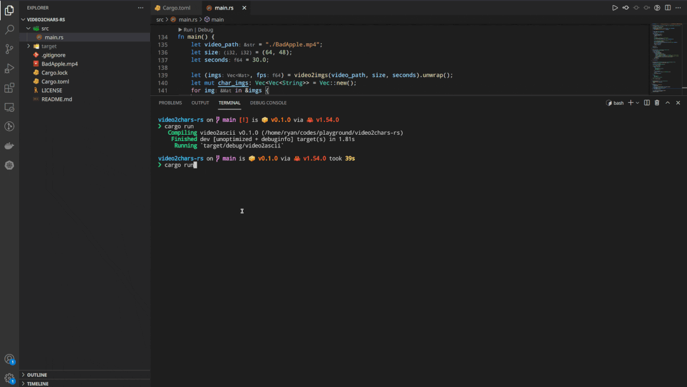

# video2ascii-rs

yet another video2ascii in rust.

## How to Build

download `BadApple.mp4` into project root directory first: <https://github.com/ryan4yin/video2chars/raw/master/tests/BadApple.mp4>

then install dependencies:

for `opensuse`:

```shell
sudo zypper in libvpx-devel libopus-devel
sudo zypper in opencv opencv-devel
sudo zypper in clang clang-devel
brew install opencv

# use mpv to play audio
sudo zypper in mpv
```

for macOS:

```shell
brew install opencv
# macOS can't find libclang.dylib dynamic library because it resides in a non-standard path
# specify the path of libclang.dylib manually here
export DYLD_FALLBACK_LIBRARY_PATH="$(xcode-select --print-path)/usr/lib/"
cargo build

# use mpv to play audio
brew install mpv
```

see [opencv-rust](https://github.com/twistedfall/opencv-rust#getting-opencv)'s docs for dependencies on other system.

## How to Run

run the program via `cargo`:

```shell
cargo run
```


## Demo




## Related Projects

- [video2chars](https://github.com/yuansuye/video2chars)
- [Video2ASCII.jl(Julia Version)](https://github.com/ryan4yin/Video2ASCII.jl)
